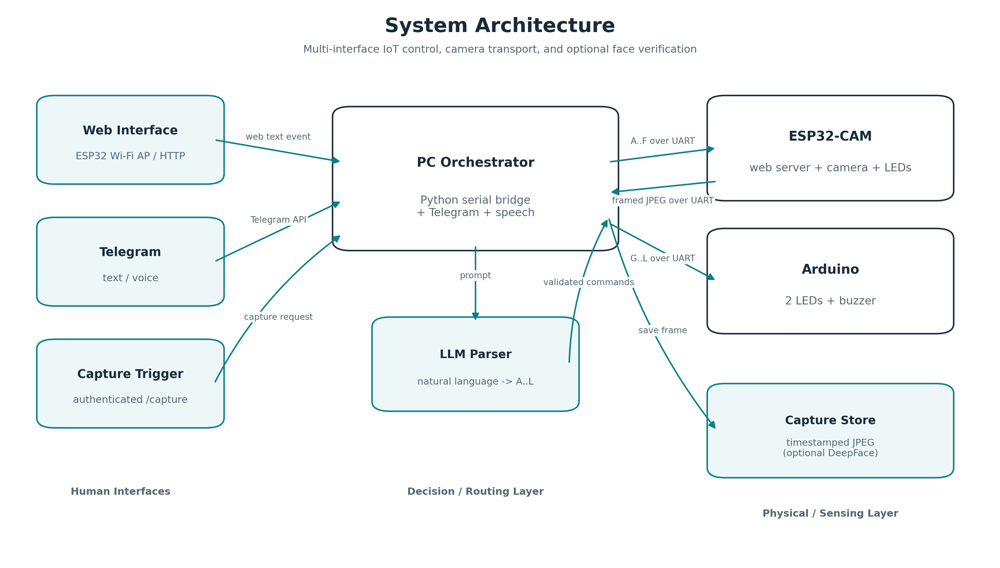
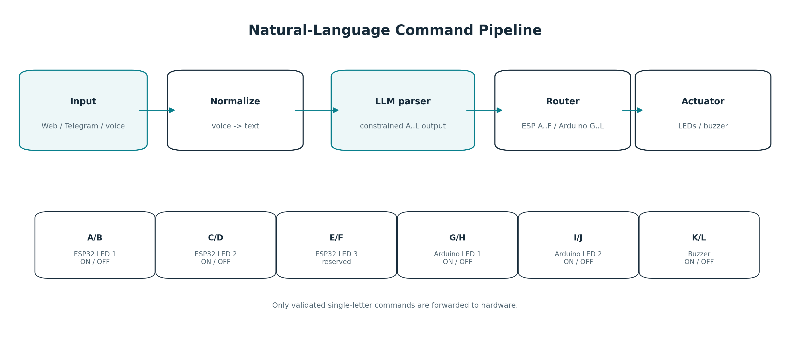
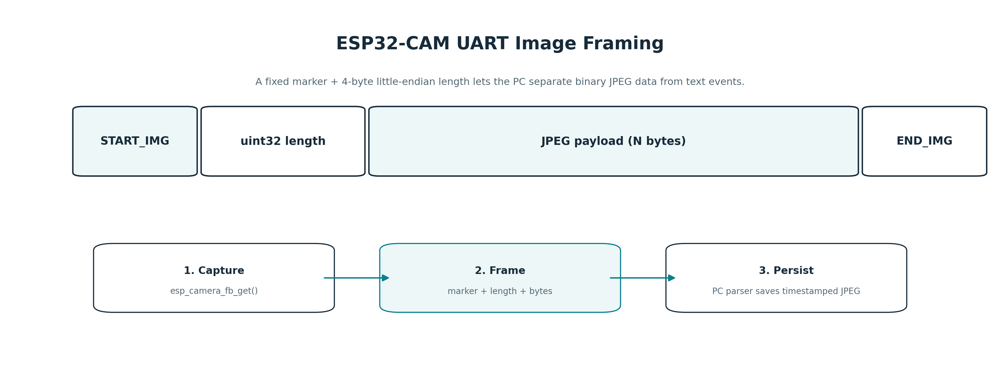

# Intelligent IoT Control System with ESP32-CAM, Arduino, Telegram, Voice, and LLM Commands

**Course:** مبانی اینترنت اشیا (Fundamentals of Internet of Things)  
**Instructor:** دکتر علی بهلولی  
**Semester:** بهار ۱۴۰۳  
**Group members:** سپهر رجبی — `4013623008` · امیرحسین جعفری — `4013613015`

This repository contains a cleaned and documented version of the course project: a multi-interface IoT control system in which an **ESP32-CAM** provides a local Wi-Fi/web gateway and camera, an **Arduino** controls additional actuators, and a **Python PC orchestrator** bridges serial communication, Telegram text/voice messages, speech recognition, and an LLM-based natural-language command parser.

> The repository-ready version intentionally contains **no API keys, Telegram bot tokens, or private face images**. Configure secrets locally using `.env` and `firmware/esp32_cam/secrets.h`.

## Architecture



The system has three layers:

1. **Human interfaces** — local ESP32 web page, Telegram text, Telegram voice, and a web-triggered camera capture.
2. **Decision/routing layer** — the Python process normalizes input, optionally transcribes audio, asks an OpenAI-compatible LLM to emit only the command alphabet `A..L`, validates that output, and routes each command to the correct serial device.
3. **Physical/sensing layer** — ESP32-CAM controls its local LEDs and camera; Arduino controls two LEDs and a buzzer. Captured JPEG frames return to the PC over UART.

## Command protocol

| Command | Target | Action |
|---|---|---|
| `A` | ESP32-CAM | LED 1 ON |
| `B` | ESP32-CAM | LED 1 OFF |
| `C` | ESP32-CAM | LED 2 ON |
| `D` | ESP32-CAM | LED 2 OFF |
| `E` / `F` | ESP32-CAM | Reserved for LED 3; not wired in the supplied prototype |
| `G` | Arduino | LED 1 ON |
| `H` | Arduino | LED 1 OFF |
| `I` | Arduino | LED 2 ON |
| `J` | Arduino | LED 2 OFF |
| `K` | Arduino | Buzzer ON |
| `L` | Arduino | Buzzer OFF |



## Camera transport

The ESP32-CAM does **not** return the JPEG as the `/capture` HTTP body. The endpoint triggers a capture, while the actual image is framed and transmitted over the ESP32 UART:

```text
START_IMG | uint32_le(image_length) | JPEG bytes | END_IMG
```

The PC-side parser can receive text events and framed binary images from the same serial stream and stores images under `data/captures/`.



At 115200 baud, the idealized wire time for an `N`-byte image is approximately `10N / 115200` seconds when accounting for start/stop bits; reducing the ESP32-CAM frame to QVGA is therefore useful for a UART-based laboratory prototype.

## Repository layout

```text
.
├── .env.example
├── .gitignore
├── README.md
├── SECURITY.md
├── requirements.txt
├── requirements-face.txt
├── src/
│   ├── iot_controller.py
│   └── face_verify.py
├── tools/
│   └── capture_request.py
├── firmware/
│   ├── arduino/Arduino_IOT.ino
│   └── esp32_cam/
│       ├── ESP_AC_IOT.ino
│       └── secrets.h.example
├── data/
│   ├── captures/.gitkeep
│   └── reference_faces/.gitkeep
└── docs/
    ├── report.tex
    └── figures/
        ├── architecture.png
        ├── command_flow.png
        └── camera_protocol.png
```

## Hardware

The submitted prototype uses:

- AI Thinker-style ESP32-CAM module
- Arduino-compatible board connected to the PC over USB serial
- Two ESP32-side LED outputs (`GPIO 4`, `GPIO 33` in the supplied firmware)
- Arduino LED 1 on pin `2`
- Arduino LED 2 on pin `4`
- Arduino buzzer on pin `3`
- PC running the Python orchestrator

Both serial devices use **115200 baud**.

## Setup

### 1. Clone and create a Python environment

```bash
git clone <your-repository-url>
cd IoT-Final-Project
python -m venv .venv
```

Activate the environment, then install the core requirements:

```bash
pip install -r requirements.txt
```

For optional face verification:

```bash
pip install -r requirements-face.txt
```

### 2. Configure PC-side secrets

```bash
cp .env.example .env
```

Edit `.env` and set at least:

- `ESP32_PORT`
- `ARDUINO_PORT`
- `LLM_API_KEY`
- `TELEGRAM_BOT_TOKEN`

The defaults preserve the original laboratory assumptions where practical (`COM13`, `COM4`, 115200 baud, and an OpenAI-compatible LLM endpoint), but they are intentionally configurable.

### 3. Configure ESP32-CAM secrets

```bash
cp firmware/esp32_cam/secrets.h.example firmware/esp32_cam/secrets.h
```

Set a private AP password and web-login credentials, then flash `firmware/esp32_cam/ESP_AC_IOT.ino` using the appropriate ESP32-CAM board profile.

### 4. Flash the Arduino

Flash `firmware/arduino/Arduino_IOT.ino` to the Arduino board and connect it to the port configured by `ARDUINO_PORT`.

### 5. Run the orchestrator

```bash
python src/iot_controller.py
```

The process waits for the ESP32 message `CONFIG_COMPLETE`. After a successful web login, the ESP32 tells the PC whether Telegram control was enabled. Invalid web credentials cause the PC to pulse the Arduino buzzer as feedback.

## Operating modes

### Local web command

1. Connect to the ESP32 access point.
2. Open `http://192.168.4.1/` (or your configured AP IP).
3. Sign in.
4. Enter a natural-language device command on the message page.
5. The PC receives the text over UART, maps it to `A..L`, validates the result, and routes it to ESP32 or Arduino.

### Telegram text command

Enable the Telegram checkbox at ESP32 login, then send a text message to the configured bot. The same command mapping and routing pipeline is used.

### Telegram voice command

Voice messages are downloaded, converted from OGG to WAV, transcribed, and then passed through the same constrained command parser.

### Camera capture

Use the web `Capture image` link, or trigger it from the PC:

```bash
python tools/capture_request.py
```

The HTTP response is only confirmation. The actual JPEG is transferred through UART and saved by `iot_controller.py`.

### Optional face verification

The separately supplied face-recognition prototype used DeepFace to compare one query image against multiple reference images. The repository-ready utility generalizes that idea without hard-coded Windows paths:

```bash
python src/face_verify.py data/captures/esp32_image_YYYYMMDD_HHMMSS.jpg \
  --reference-dir data/reference_faces
```

Reference faces are excluded from Git by default because they are sensitive biometric data.

## Improvements over the submitted prototype

The public version preserves the project concept while correcting repository and maintainability issues found during review:

- removes embedded LLM and Telegram credentials;
- moves machine-specific configuration to `.env`;
- moves ESP32 AP/web credentials to ignored `secrets.h`;
- replaces the duplicated/blocking image-reception logic with one incremental mixed text/binary parser;
- fixes the original capture-helper misconception (HTTP confirmation vs. UART JPEG transfer);
- uses an explicit `uint32_t` image-length field so the PC and ESP32 agree on frame format;
- validates LLM output before it reaches hardware;
- documents `E/F` as reserved because the third ESP32 LED is not connected in the supplied hardware;
- makes DeepFace verification path-independent and optional;
- excludes captures, voice files, reference faces, and secrets from version control.

## Known limitations

This is a **course/laboratory prototype**, not a production home-automation platform. In particular:

- The ESP32 web server uses local HTTP, not HTTPS.
- Authentication state is simple and device-global rather than per-browser session.
- Natural-language control depends on an external LLM service.
- Telegram and speech recognition depend on Internet connectivity.
- Serial UART is suitable for the prototype but is relatively slow for images.
- There is no acknowledgement/retry protocol for device commands.
- `E/F` are reserved because the third ESP32 LED was disabled due to hardware/pin constraints.
- Face verification should not be treated as a security boundary without a dedicated biometric threat model and evaluation dataset.

## Report

The Persian XeLaTeX report is in [`docs/report.tex`](docs/report.tex). It follows the RTL/LTR conventions and typography style of the supplied sample: `xepersian`, explicit Latin spans, `tcolorbox`, XeLaTeX, Persian-first narrative, and embedded architecture/data-flow figures.

Compile from the `docs` directory with XeLaTeX (twice for stable references/TOC):

```bash
cd docs
xelatex report.tex
xelatex report.tex
```

## Security note before publishing

The originally supplied Python prototype contained hard-coded service credentials. **Rotate/revoke those original credentials before making any repository public**, even though this cleaned ZIP no longer contains them. See [`SECURITY.md`](SECURITY.md).

## Academic provenance

This repository is a cleaned presentation of the submitted project sources and the separately supplied face-verification script. Changes in the GitHub-ready version are primarily configuration hardening, parser cleanup, documentation, and correction of prototype inconsistencies; they do not change the central architecture of ESP32-CAM + Arduino + PC orchestration + Telegram/voice/LLM command control.
